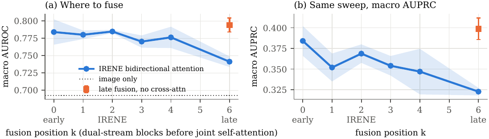

# IRENE-MM: where and how to fuse, on public multimodal chest X-ray data

📄 **Paper (PDF): [`paper/main.pdf`](paper/main.pdf)**  ·  LaTeX source: [`paper/`](paper/)

This fork takes the official code of **IRENE** ([Zhou et al., *Nature Biomedical Engineering* 2023](https://www.nature.com/articles/s41551-023-01045-x)) and turns it into a complete, reproducible project that runs on **public data**:

* **Data pipeline** for image + unstructured text + structured data samples from the public
  [COVID-19 Image Data Collection](https://github.com/ieee8023/covid-chestxray-dataset) (782 chest X-rays, 424 patients, free-text clinical notes, demographics, vitals and labs, 7 diagnoses). It covers text cleaning (Unicode normalization, URL and figure-reference stripping, date de-identification, **masking of label-leaking diagnosis terms**), structured features with explicit missingness masks, and **patient-grouped** stratified 5-fold CV.
* **IRENE-MM** ([`models/irene_mm.py`](models/irene_mm.py)): one configurable IRENE-style transformer in which every fusion choice is a switch:
  * fusion position `k` (0 = early fusion, 2 = IRENE, L = late fusion)
  * cross-modal attention structure: IRENE's bidirectional `(self+cross)/2`, ViLBERT-style co-attention, image→text, text→image, Flamingo-style tanh-gated, or none
  * image–text alignment in a shared embedding space: **CLIP / InfoNCE** or **SigLIP**, computed "align-before-fuse" on unimodal embeddings, with multi-positive targets for images of the same patient
  * key-padding masks, learned missing-value embeddings, and modality dropout
* **Training stack** ([`train.py`](train.py)): PyTorch `DataLoader` (workers, pinned memory, persistent workers, prefetch), **native AMP** (fp16 + GradScaler on GPU, bf16 on CPU), **DDP** through `torchrun` (NCCL/Gloo) with `DistributedSampler`, and **Weights & Biases** logging. The deprecated NVIDIA `apex` from the original repo is removed.
* **A 29-configuration ablation study** (330 fold-level trainings) with pooled out-of-fold metrics, patient-level bootstrap CIs, missing-modality robustness, cross-modal retrieval and shortcut probes. Everything is written up in the paper.

## Key results

Macro AUROC, 5-fold patient-grouped CV, pooled out-of-fold, mean ± s.d. over seeds. *No note* = the same model with the note removed at test time. *Mixed-source* = the 395 images from the two repositories that contain both COVID and non-COVID cases, where the source host cannot reveal the label.

| Model | AUROC | AUROC, no note | AUROC, mixed-source |
|---|---|---|---|
| Image only | 0.693 ± 0.014 | 0.693 | 0.662 |
| Note + structured | 0.757 ± 0.026 | 0.549 | 0.686 |
| Early fusion (k=0) | 0.784 ± 0.018 | 0.621 | 0.724 |
| **IRENE (k=2, bidirectional)** | 0.785 ± 0.002 | 0.588 | 0.723 |
| **Late fusion (k=6)** | **0.794 ± 0.010** | 0.655 | 0.729 |
| IRENE, cross-attention in all 6 layers | 0.741 ± 0.008 | 0.586 | 0.682 |
| IRENE, co-attention (no self-attention) | 0.752 ± 0.005 | 0.591 | 0.692 |
| IRENE + CLIP (λ = 0.5) | 0.726 ± 0.003 | 0.617 | 0.683 |
| Late fusion + CLIP (λ = 0.5) | 0.793 ± 0.004 | 0.699 | 0.720 |
| IRENE + modality dropout (p = 0.3) | 0.772 ± 0.023 | **0.736** | 0.719 |

Takeaways:

* Fusing image, note and structured data beats every partial input.
* IRENE's shallow bidirectional attention matches early and late fusion. Cross-attention at every layer, or cross-attention without self-attention, overfits.
* A CLIP or SigLIP auxiliary loss hurts mid fusion at this data scale, and is neutral for a dual encoder, which also gives the best retrieval.
* Fused models depend on the note; modality dropout fixes most of this.
* The publication source alone reaches 0.740 AUROC (a confounder), so we also report a de-confounded subset.

<p align="center"></p>

## Repository layout

```
data/prepare.py              cohort, labels, text cleaning/masking, structured features, grouped folds
data/features.py             frozen CXR DenseNet tokens (+ cached augmentations), word-vector note tokens
models/irene_mm.py           IRENE-MM (fusion position / attention structure / contrastive switches)
models/*.py, irene.py        original IRENE code (apex replaced by torch.autocast)
train.py                     CV training: DataLoader, AMP, DDP (torchrun), W&B
scripts/run_experiments.py   the full experiment grid of the paper (resumable)
scripts/classical_baselines.py   logistic-regression shortcut probes (source, view, TF-IDF)
scripts/benchmark_throughput.py  DataLoader / AMP / DDP throughput
scripts/make_figures.py      all figures, LaTeX tables and every number quoted in the paper
results/                     per-run JSON + OOF predictions, summary.json, W&B offline runs
paper/                       LaTeX source and compiled main.pdf
```

## Reproduce

```bash
pip install -r requirements.txt
pip install https://github.com/explosion/spacy-models/releases/download/en_core_web_md-3.8.0/en_core_web_md-3.8.0-py3-none-any.whl
bash scripts/download_data.sh                      # clones ieee8023/covid-chestxray-dataset into data/raw/
python data/prepare.py                             # -> data/processed/covidcxr_mm.pkl, stats.json
python data/features.py                            # -> data/processed/features.npz (~15 min on 2 CPU cores)
python scripts/run_experiments.py --parallel 2     # full grid (~10 CPU-hours; much faster on GPU)
python scripts/classical_baselines.py
python scripts/benchmark_throughput.py && torchrun --nproc_per_node 2 scripts/benchmark_throughput.py --ddp
python scripts/make_figures.py                     # figures, tables, paper/numbers.tex
cd paper && latexmk -pdf main.tex
```

Single runs:

```bash
python train.py --name irene --fusion_layer 2 --cross_mode bi_avg --doc_dim 128 --seeds 0 1 2
python train.py --name irene_clip --fusion_layer 2 --contrastive clip --lam 0.5 --doc_dim 128
torchrun --nproc_per_node 4 train.py --name ddp --amp --doc_dim 128        # multi-GPU with AMP
wandb sync results/wandb/offline-run-*                                     # upload offline W&B logs
```

**Hardware note.** All reported experiments ran on a 2-core CPU machine without a GPU. The model is therefore a narrow IRENE (d = 128, 6 layers, 16 image tokens from a frozen [torchxrayvision](https://github.com/mlmed/torchxrayvision) DenseNet-121). The AMP, DDP and DataLoader code paths were exercised and benchmarked on CPU (bf16, Gloo). They run unchanged on GPUs (fp16, NCCL), but GPU utilization was not measured.

## Project history

| Date | Commit | What |
|---|---|---|
| 2023-04 to 2023-06 | `bcc14ff`, `e159a97`, `128c822` | Original IRENE code (model + inference script), from the official release of Zhou et al. |
| 2026-09 | branch `irene-mm-public-data` | Public-data pipeline, IRENE-MM ablation study, modernized training stack, paper |

The new work is a direct continuation of the original history: the `irene-mm-public-data` branch is built on top of `128c822`, so every original commit is kept unchanged.

## Original IRENE

IRENE treats every input modality uniformly as a token sequence. The first two layers apply *bidirectional multimodal attention* between the image stream and the clinical stream, followed by joint self-attention. The original inference script is kept as `irene.py` (see `run.sh`). It expects a pickle with keys `pdesc` (chief-complaint token embeddings), `bics` (age, sex), `bts` (lab values) and `label`. `data/prepare.py` writes the same keys for the public dataset.

## Citation

```bibtex
@article{zhou2023irene,
  title={A transformer-based representation-learning model with unified processing of multimodal input for clinical diagnostics},
  author={Zhou, Hong-Yu and Yu, Yizhou and Wang, Chengdi and Zhang, Shu and Gao, Yuanxu and Pan, Jia and Shao, Jun and Lu, Guangming and Zhang, Kang and Li, Weimin},
  journal={Nature Biomedical Engineering}, year={2023}, doi={10.1038/s41551-023-01045-x}
}
@article{cohen2020covid,
  title={COVID-19 Image Data Collection: Prospective Predictions Are the Future},
  author={Cohen, Joseph Paul and Morrison, Paul and Dao, Lan and Roth, Karsten and Duong, Tim Q and Ghassemi, Marzyeh},
  journal={Machine Learning for Biomedical Imaging}, year={2020}
}
```

Dataset images keep their original licenses (see the dataset repository). They are not redistributed here.
